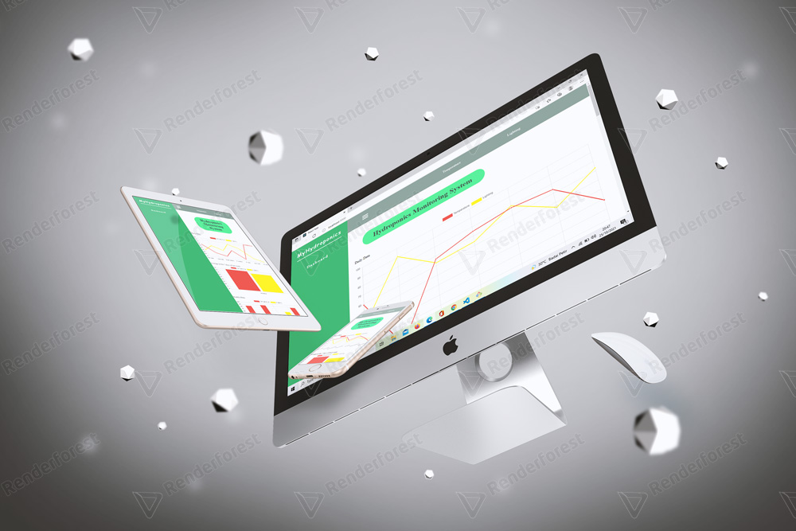

<p align="center">
  <h1 align="center">MyHydroponics</h1>
  <a href="https://github.com/HaryNovalRamadhan/MyHydroponics">
    
  </a>
</p>

## Table of Contents

- [About the Project](#about-the-project)
  - [Built With](#built-with)
- [Getting Started](#getting-started)
  - [Prerequisites](#prerequisites)
  - [Installation](#installation)
- [Preview](#preview)
  - [Website Version](#Website-version)
  - [Tab Version And Mobile Version](#tab-version)
- [Contact](#contact)

<!-- ABOUT THE PROJECT -->

## About The Project

MyHydroponics is Hydroponics monitoring system Web Base.

### Built With

- [Javascript](https://www.javascript.com/)
- [ReactJs](https://reactjs.org/)

<!-- GETTING STARTED -->

## Getting Started

### Prerequisites

Before going to the installation stage there are some software that must be installed first.

- [NodeJs](https://nodejs.org/en/download/)

### Installation


1. Clone the repo

```sh
git clone https://github.com/HaryNovalRamadhan/MyHydroponics
```

2. Install NPM packages

```
npm install
```

4. Run the project

```
  npm run start
```

## Preview

### Website Version

  <image src='./src/mockup/dekstop.jpg' />

### Tab Version And Mobile Version

  <image src='./src/mockup/phone&tablet.jpg' />


<!-- CONTACT -->

## Contact

- Email - noval.ramadan600@gmail.com
- LinkedIn - [@Hary Noval Ramadhan](https://www.linkedin.com/in/hary-noval-ramadhan-7ab597218/)